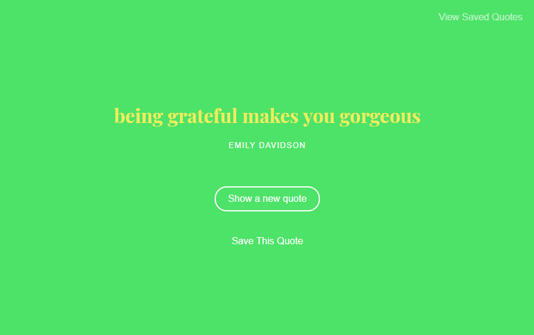
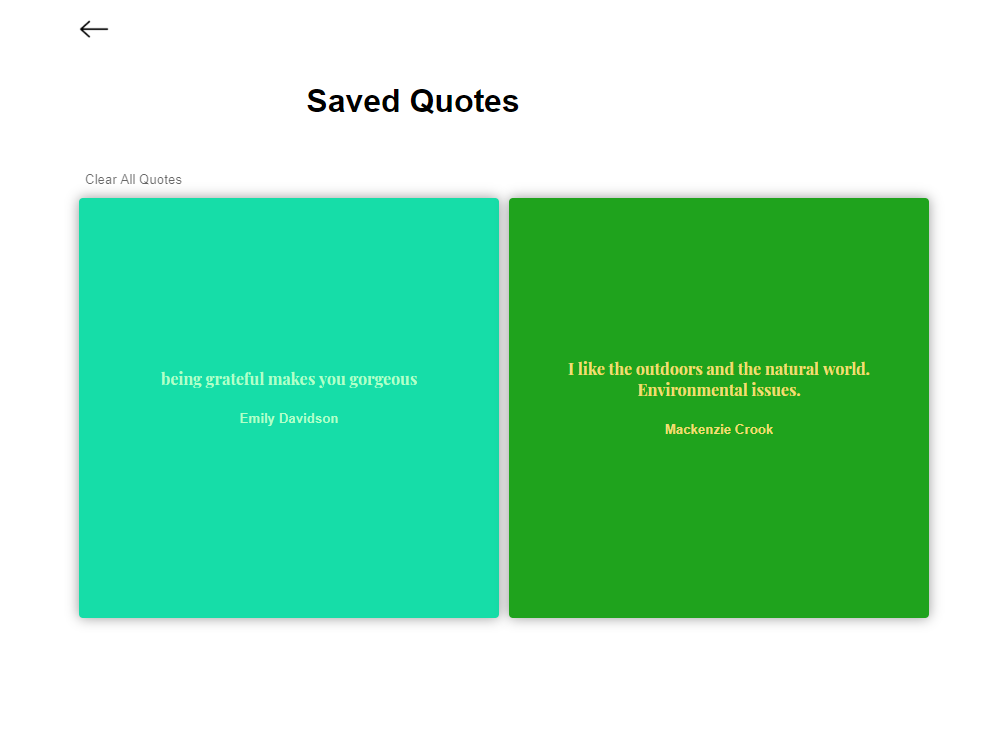

## Introduction
Sometimes you just need a quote to add the end of your blog post or maybe to just have something for those motivational mondays post. Quotez makes this easy for you in a colorful way. Simply, Quotez is random quote generator that also allows you to save quotes.

## Installation
1. npm install
2. npm start

## Technical Description

Quotez is built in ReactJS. It uses a quote API to fetch a random quote and display it. You can also save quotes in cards. Quotes are saved using the browser's native local storage so you can leave, come back and your quote will be there. It uses React Router to navigate between the main screen and the saved quotes screen. It also remembers the colors when saving.